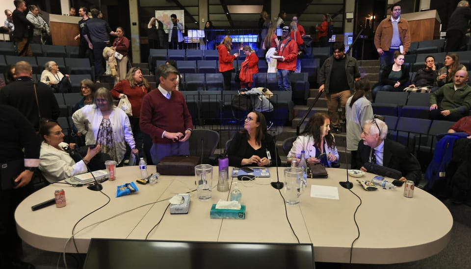

Everything you read on this blog comes straight from my own brain—my thoughts, opinions, and yes, even the occasional typo! All views expressed here are solely mine and do not represent those of my employer or anyone else. I take full responsibility for the content I share, so if you spot any errors, please feel free to [let me know](mailto:blog@ebardelli.com). I hope you enjoy reading my personal takes on various topics!

## About Me

I am the Executive Director of Information and Evaluation for Santa Rosa City Schools.

I received a doctorate in Educational Studies from the University of Michigan, where I was a predoctoral fellow in the IES training program in Causal Inference in Educational Policy Research (CIEPR). I was also a postdoctoral research associate in education policy at the Annenberg Institute at Brown University.

I grew up in Italy. I earned a Bachelor of Science in Mathematics from the Università degli Studi di Modena e Reggio Emilia, and a Master of Arts in Education and a teaching credential from California State University, Los Angeles. I also worked as an instructional coach and middle and high school mathematics teacher in Los Angeles and Lodi, California, for five years.

I use the pronouns he/him/his.
